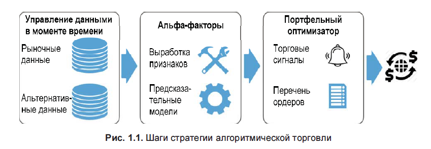
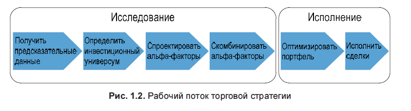

# Янсен Машинное обучение

## Категории стратегий троговли

Существует несколько категорий стратегий торговли, в которых для исполнения торговых правил используются алгоритмы:
- краткосрочные сделки, которые ориентированы на получение прибыли от небольших ценовых движений, например из-за арбитража;
- поведенческие стратегии, ориентированные на извлечение прибыли от предвосхищения поведения других участников рынка;
- программы, ориентированные на оптимизацию исполнения сделок;
- большая группа торговой активности на основе предсказанной оценки стоимости активов.

Поведенческие алгоритмы обычно работают в условиях низкой ликвидности и призваны предвосхищать возможность существенного влияния на цену шагов более крупного игрока. 
Ожидание воздействия на цену основано на алгоритмах-снифферах (вынюхивающих алгоритмах), которые генерируют проникновение в сущность стратегий других участников рынка, либо на рыночных регулярностях, таких как вынужденные сделки, осуществляемые биржевыми фондами ETF.

Программы исполнения сделок призваны ограничивать влияния сделок на финансовый рынок и варьируются от простого деления сделок на части до заключения сделок на определенную сумму или объем на регулярной основе методом ценообразования, средневзвешенного по времени (time-weighted average pricing, TWAP), и ценообразования, средневзвешенного по объему (volume-weighted average pricing, VWAP). Простые алгоритмы привлекают исторические регулярности, в то время как более изощренные алгоритмы учитывают трансакционные издержки, дефицит реализации или предсказанные ценовые движения. Эти алгоритмы могут работать на уровне ценных бумаг или портфеля, например, для реализации сделок с многоногими деривативами или со срезами (перекрестными сечениями) активов.

## Примеры использования машинного обучения для торговли на финансовых рынках

МО извлекает сигналы из широкого спектра рыночных, фундаментальных и альтернативных данных и может применяться на всех этапах процесса стратегии алгоритмической торговли. 

Ключевые применения охватывают:
- глубинный анализ данных для выявления регулярности и извлечения признаков;
- контролируемое обучение для генерирования рисковых факторов или альф и создания торговых идей;
- агрегирование отдельных сигналов в стратегию;
- размещение финансовых средств среди портфельных активов в соответствии с усвоенными алгоритмом рисковыми профилями;
- тестирование и оценивание стратегий, в том числе посредством использования синтетических данных;
- интерактивная, автоматизированная детализация стратегии с использованием подкрепляемого обучения.

Главным обоснованием применения МО к торговле на фининсовых рынках является получение предсказаний фундаментальных показателей активов, ценовых движений или рыночных условий. 
Стратегия может привлекать несколько автоматически обучающихся алгоритмов, которые надстраиваются друг над другом.
Нисходящие модели могут генерировать сигналы на уровне портфеля путем интегрирования предсказаний о перспективах отдельных активов, об ожиданиях рынка капитала и о корреляции между ценными бумагами. 
В качестве альтернативы предсказания автоматически обучающихся алгоритмов могут информировать дискреционные сделки. 
Предсказания автоматически обучающихся алгоритмов могут также ориентироваться на конкретные рисковые факторы, такие как стоимость или волатильность, либо применять технические подходы, такие как следование за трендом или разворот к среднему
ценовому уровню.

МО используется для размещения финансовых средств среди портфельных активов, применяя модели деревьев решений, которые вычисляют иерархическую форму паритета риска. 
Как результат, характеристики риска стимулируются не классами финансовых активов, а регулярностями в ценах финансовых активов, и достигают превосходящих показателей компромисса между риском и возвратностью.

## Важные категории факторов

### Импульсные и сентиментные факторы

Импульсное инвестирование следует поговорке: тренд — ваш друг, или пусть победители работают. 
Импульсные рисковые факторы предназначены для того, чтобы лонговать на активах, которые показывали хорошую результативность, и шортить на активах с низкой результативностью за определенный период.

### Стоимостные факторы

Акции с низкими ценами относительно их фундаментальной стоимости тяготеют к обеспечению финансовых возвратов, превышающих эталон, взвешенный по капитализации. 
Стоимостные факторы отражают эту корреляцию и предназначены для подачи сигналов на покупку недооцененных активов, т. е. относительно дешевых, и продажу переоцененных и дорогих. 
Справедливая стоимость может быть определена как абсолютный ценовой уровень, спред по отношению к другим активам или диапазон, в котором актив должен торговаться (например, два стандартных отклонения).
Стоимостные стратегии опираются на разворот цен к справедливой среднеуровневой стоимости актива. 
Они исходят из того, что цены отклоняются от справедливой стоимости лишь временно из-за поведенческих эффектов, таких как чрезмерная реакция или стадный эффект, или эффектов ликвидности, таких как временное
влияние на финансовый рынок или долговременные трения между спросом и предложением. 
Поскольку стоимостные факторы опираются на разворот к среднему уровню, они часто проявляют свойства, противоположные свойствам импульсных факторов.

- Фундаментально-стоимостные стратегии выводят справедливую стоимость активов из экономических и фундаментальных индикаторов, которые зависят от целевого класса актива.
- Рыночно-стоимостные стратегии используют статистические модели или автоматически обучающиеся модели, выявляя ошибочную оценку стоимости активов изза неэффективностей в предоставлении ликвидности.
- Относительные стоимостные стратегии на срезе активов сосредоточены на относительной ошибочной оценке стоимости различных активов.

### Волатильностные и размерные факторы

Низковолатильностный фактор улавливает избыточные финансовые возвраты от акций, чья волатильность, бета или идиосинкратический риск ниже среднего.
Низковолатильностная аномалия представляет собой эмпирическую головоломку, которая противоречит основным принципам финансов. 
Модель ценообразования капитальных активов (Capital Asset Pricing Model, CAPM) и другие модели оценивания стоимости активов утверждают, что более высокий риск должен приносить более высокие возвраты, однако на многих рынках и в течение продолжительных
периодов наблюдалось обратное, когда менее рискованные активы превосходили по результативности своих более рискованных сверстников.

### Качественные факторы

Качественный фактор призван улавливать избыточный финансовый возврат от компаний, которые являются высокоприбыльными, операционно эффективными, безопасными, стабильными и хорошо управляемыми, короче говоря, высококачест-
венными, в сопоставлении с рынком. Рынки также, судя по всему, вознаграждают относительную определенность заработков и наказывают акции с высокой волатильностью заработков. 
Главная трудность заключается в том, как определять качественный фактор непротиворечиво и объективно, используя квантитативные индикаторы в условиях субъективной природы качества.

Альфа-факторы приводят в действие алгоритмическую стратегию, транслируемую в сделки, которые, в свою очередь, порождают инвестиционный портфель. 
Финансовые возвраты и риск результирующего портфеля определяют успех стратегии. 
Тестирование стратегии предусматривает симулирование портфелей, генерируемых алгоритмом, в целях проверки результативности портфеля в рыночных условиях. 
Оценивание стратегии включает бэктестирование на исторических данных с целью оптимизации параметров стратегии и форвардное тестирование с целью проверки внутривыборочной результативности на новых вневыборочных данных и предотвращения ложных обнаружений, возникающих из-за приспосабливания стратегии к конкретным прошлым обстоятельствам.

## Категории моделей МО

- линейные модели для регрессии и классификации срезовых (кросс-секционных), рядовых и панельных данных
- обобщенные аддитивные модели, включая нелинейные древесные модели, такие как деревья решений
- ансамблевые модели, включая случайный лес и градиентно-бустинговые машины
- неконтролируемые линейные и нелинейные методы снижения размерности и методы кластеризации
- нейросетевые модели, включая рекуррентные и сверточные архитектуры
- модели подкрепляемого обучения

Существует несколько полезных применений неконтролируемого обучения, которые могут быть задействованы в алгоритмической торговле, включая следующие:
- группировка ценных бумаг с аналогичными характеристиками риска и возвратности
- нахождение малого числа рисковых факторов, стимулирующих результативность гораздо большего числа ценных бумаг
- выявление торговых и ценовых регулярностей, которые различаются систематически и могут создавать более высокие риски
- выявление латентных тем в массиве документов (например, в стенограммах телеконференций о корпоративных заработках), которые составляют наиболее важные аспекты этих документов.

На высоком уровне эти применения опираются на методы выявления кластеров и методы снижения размерности данных.

Sources: 

- [machine-learning-for-trading](https://github.com/stefan-jansen/machine-learning-for-trading)
- [Machine-Learning-for-Algorithmic-Trading-Second-Edition](https://github.com/PacktPublishing/Machine-Learning-for-Algorithmic-Trading-Second-Edition)

